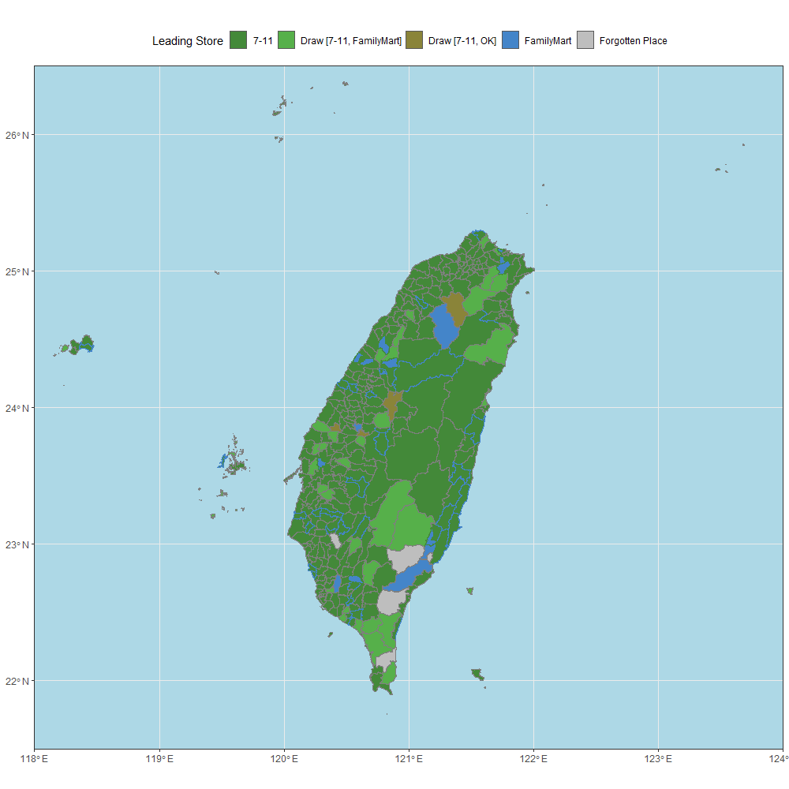

# 全台便利商店分布狀況

---
## 必讀

首先，最重要的就是如果直接照著code去跑，絕對得不到我的成果。因為在四大超商網站中，他們在地區名稱上都有系統性的問題，也就是台和臺之間的誤用，所以在直接合併資料上會出現問題。因為懶惰關係，我就沒有在code裡面寫上相關的轉換了，是用手動替換的成果。目前上傳的`data`部分即是我手動處理的成果，可以直接使用。

其次，我沒有附上使用的台灣SHP檔，可自行在[這裡](https://data.gov.tw/dataset/7441)下載，放進`data/taiwan`即可。

最後，我同時使用`R`和`Python`兩個程式語言，用`Python`抓資料，用`R`來處理繪圖過程。至於為何如此，純粹是使用習慣而已。

---
## 使用

在`Python`部分，只要用`pip`安裝套件就可以使用。但我是用非常土炮的一個一個script去跑，沒有寫任何`__main__.py`來控制，所以就一個一個跑即可。`R`的部分也是直接跑就可以，只是要注意的是畫圖要畫一點時間，另外我也沒特別寫圖輸出的尺寸，我自己是使用`RStudio`輸出，尺寸為`1000*1000`。
